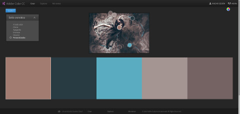

# LMSGI_02-CSS
## Introducció al CSS

A partir del contingut de la pàgina d'introducció al HTML, s'ha complementat amb una fulla d'estil CSS:

### [Les tres lleis de la màgia de Brandon Sanderson](https://rawgit.com/2aven/LMSGI_02-CSS/master/index.html)

Només s'han modificat algunes línies de l'arxiu *index.html* per incloure blocs *div*, o la capçalera de la taula *th*, però la major part de la tasca es concentra a la creació de la fulla d'estil [*css/mistb.css*](https://rawgit.com/2aven/LMSGI_02-CSS/master/css/mistb.css), utilitzant els selectors d'*element*, *class* o de *id*.

S'ha emprat una paleta de colors generada a partir de les tonalitats clau de la imatge que acompanya la pàgina, fent ús de l'eina [**Rueda cromática**](https://color.adobe.com/es/create/color-wheel/?base=2&rule=Custom&selected=0&name=vin&mode=rgb&rgbvalues=0.6352941176470588,0.48627450980392156,0.44313725490196076,0.1568627450980392,0.23137254901960785,0.25882352941176473,0.35294117647058826,0.6745098039215687,0.7568627450980392,0.6431372549019608,0.5843137254901961,0.5725490196078431,0.4588235294117647,0.38823529411764707,0.38823529411764707&swatchOrder=0,1,2,3,4) de la pàgina de Adobe Color.

S'ha aplicat color de fons a la pàgina i als rètols informatius emprats h1 i h4; no obstant, s'ha omés aquest pas pel rètol h3, que serà utilitzat dins la taula que ja obté diferents colors de fons segons la línia.

S'han modificat també els colors dels enllaços, així com la font i grandària del text.

La pàgina és validada per [http://jigsaw.w3.org/css-validator/](http://jigsaw.w3.org/css-validator/)
